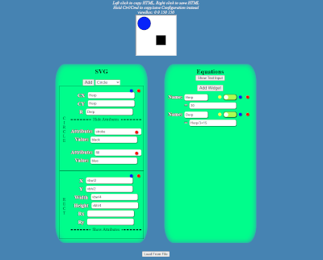
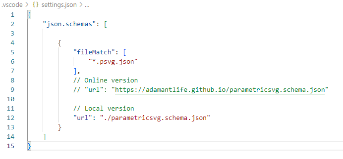
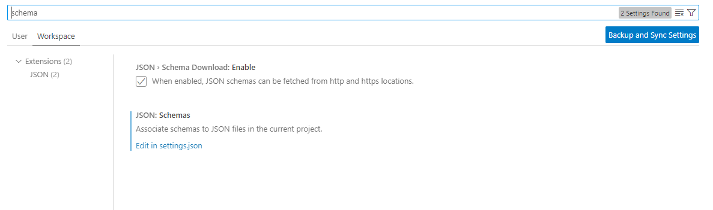
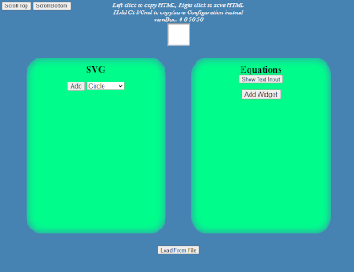

# ParametricSVG

## Overview
ParametricSVG is a collections with four primary components:
1. [A Json Schema](#json-schema) defining the ParametricSVG format
2. An [equation evaluation](#equations) function
3. The [ParametricSVG](#parametricsvg) Object with a parsing function and additional properties and functions for managing SVG namespace, format, and other attributes
4. A GUI for assembling and defining equations

## JSON Schema
The JSON Schema can be used to validate JSON files that will be parsed by ParamtricSVG and can provide autocomplete in editors. It is included in this repository and can also be [accessed here](https://adamantlife.github.io/parametricsvg.schema.json). The preferred filename suffixes are `{filename}.psvg.json`.

In summary, the schema defines the following JSON Object:
* **attributes**
    * { Object containing html **attributename**:*attribute value* entries }
* **equations**
    * { Object containing Variable Objects whose key is the Variable's **name** }
        * Variable Objects require **name** and **value** entries
        * The **comment** and **disabled** properties as optional
        * Additional properties are disallowed
* **svgcomponents**
    * [ An Array containing Objects defining SVG Components to append to the SVG Element ]
        * All objects require **type** to be defined (e.g.- `circle`, `rect`, `path`)
            * Depending on **type**, additional properties may be required
        * **attributes** is an optional property and is an Object containing html {**attribute**:*atribute value*} entries which will be added to the constructed Component.
        * Additional properties not defined by the **type** are disallowed

#### VSCode
If you are using VSCode, you can modify `settings.json` to add the schema for validation via the `json.schemas` key. This can be done per the **user** or **workspace** `settings.json` file.

If you have trouble locating the settings file, you can go to **Settings** (`ctrl+,`) and search for "*schema*". This will also allow you to enable automatic downloading if using the *github.io* url.

## Equations
The provided equation parser (`evaluateEquation()` in *equations.js*) has the following constraints:
* Variable names must start with a letter or underscore and be composed of values `[a-zA-Z0-9_]`
* Variable names must be unique within an execution of `evaluateEquation`
* No circular dependencies
* Decimal points must be preceded by a digit
* Implicit multiplication is not allowed (e.g.- "2x" and "4(x+1)" are invalid and should instead be "2\*x" and "4\*(x+1)")

## ParametricSVG
This is the core of the repository: its primary function is to take a JSON Object which adheres to the above [JSON Schema](#json-schema) and convert it into an `SVGElement` using `ParametricSVG.parseJSON()`. By default it does not have a method to evaluate equations and therefore throws an error: for this reason `equations.evaluateEquation()` is included. The evaluation callback can be set globally via the `ParametricSVG.evaluator` property or supplied directly to the parsing functions; callbacks provided to parsing functions will override the callback set on the `ParametricSVG` object.

The namespace PSVG uses for the `SVGElement` can be set via the `ParametricSVG.XMLNS` property. There are additional properties available for creating an XML header for saving the SVG to a file.

## GUI

Finally a simply GUI is provided as an alternative method of generating the JSON/ JSON file and SVGElement/SVG File. The SVGElement's html can be *copied* by `Left Clicking` the generated SVG, or *saved* to a file using `Right Click`. By holding down `Ctrl/Cmd`, the JSON file can be *copied* or *saved* (respectively) instead.

The `viewBox` can be set using the scroll wheel (the SVG's displayed size will be updated to match the `viewBox`). By default the increment/decrement rate is `100`:
  * Holding `Ctrl` while scrolling will change the rate to `50`
  * Holding `Ctrl+Shift` will result in `10`
  * While holding `Ctrl+Shift+Alt` provides a step of `1`

The `viewBox` always uses `(0,0)` as the top-left coordinate.

SVGComponents are added via widgets in the first (left) box. Variables/Equations can be included in any non-boolean values.

The GUI includes two global Variables: `vbw` and `vbh` which correspond to **"viewBox width"** and **"viewBox height"**.

Additional variables are declared in the second (right) box. There are three input modes:

1. Widget Mode
    * Functions similarly to SVGComponents
2. Text Mode
    * Variables can be written in a textbox using the form `{"//" to disable} {Variable Name} = {Equation}; {"//-[comment]" optional}`
    * Each Variable should be written on a new line
    * This mode does not provide feedback (success or error) and is intended to be a minimalist means of entering the equations.
3. Table Mode
    * Variables can be entered/managed in a tabular format where the first column is the **name**, second is **value**, third is a **disabled** checkbox, and last column is an optional **comment**

Feedback for the equations (such as success evaluation, duplicate name error, or syntax errors) are displayed depending on the input mode (except Text Mode).